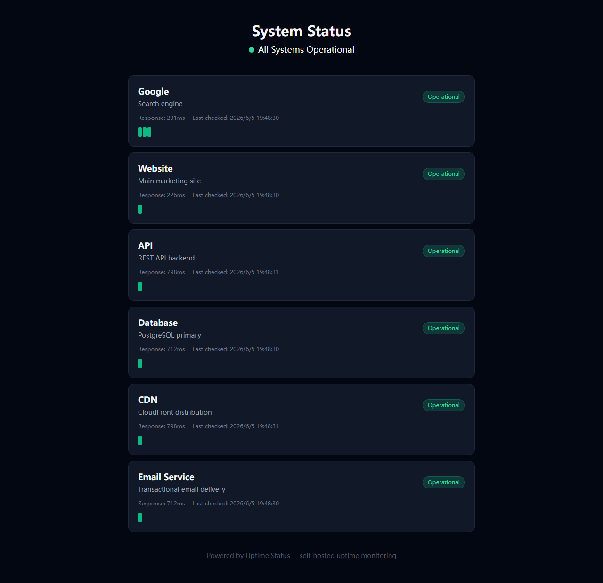

# Uptime Status

Lightweight self-hosted status page & uptime monitor. Monitor your services, display a beautiful public status page -- all in one simple Next.js app.



## Features

- **Service Monitoring** -- Add HTTP endpoints and monitor their health
- **Public Status Page** -- Beautiful, real-time status dashboard for your users
- **Admin Panel** -- Add, edit, remove services; trigger on-demand checks
- **Health Checks** -- Automatic HTTP ping with response time tracking
- **Uptime History** -- Visual bar chart of recent check results
- **Self-Hosted** -- Runs anywhere, your data stays with you
- **Zero Cost** -- Uses SQLite, deploy on free tier services

## Quick Start

### Prerequisites

- Node.js 18+
- npm or yarn

### Setup

```bash
# Clone the repo
git clone https://github.com/willy2023/uptime-status.git
cd uptime-status

# Install dependencies
npm install

# Setup database
npx prisma db push

# Start dev server
npm run dev
```

Open [http://localhost:3000](http://localhost:3000) -- status page at `/status`, admin panel at `/admin`.

### Deploy to Vercel (Free)

After pushing to GitHub, connect your repo to Vercel:
1. Go to [vercel.com/new](https://vercel.com/new)
2. Import your repository
3. Add environment variable: `DATABASE_URL="file:./data.db"`
4. Deploy!

### Deploy with Docker

```bash
docker-compose up -d
```

## Pricing

| Plan | Price | Details |
|------|-------|---------|
| **Self-Hosted** | Free | Full source code, MIT license, deploy anywhere |
| **Managed Hosting** | $19 one-time | We host it. Automatic updates, email alerts, custom domain |
| **Enterprise** | $99 one-time | White-label, SLA, priority support |

[See full pricing &rarr;](/pricing)

## Why Open Source?

1. **Trust** -- You can see exactly what it does. No telemetry, no tracking.
2. **Customization** -- Fork it, modify it, make it yours.
3. **Community** -- Feedback and contributions welcome!

## Support the Project

- [Buy Me a Coffee](https://www.buymeacoffee.com/willy2023)
- [GitHub Sponsors](https://github.com/sponsors/willy2023)
- [Get Managed Hosting](https://willy2023.gumroad.com/l/uptime-status) -- $19 lifetime

## Tech Stack

- **Next.js 14** (App Router)
- **Prisma** + SQLite
- **Tailwind CSS**
- **TypeScript**

## Roadmap

- [ ] Email/Slack/Discord alerts
- [ ] TCP/Port monitoring
- [ ] SSL certificate expiry checks
- [ ] Incident management & history
- [ ] Team multi-user access
- [ ] API key auth for programmatic access

Managed hosting customers get priority access to new features.

## License

MIT -- see [LICENSE](LICENSE)